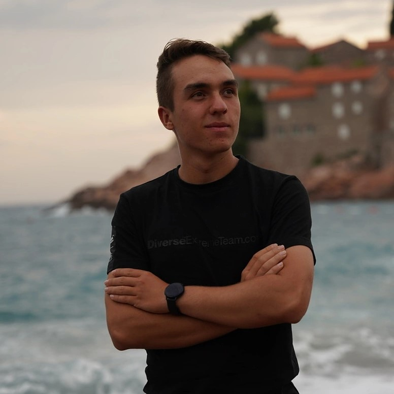

    

## Hi there 👋
### I am Android Developer, I am studying IT and Intelligent Systems at AGH University of Science and Technology in Krakow in Poland. 🏢
### I am mostly programming apps in Java or Kotlin for Android

## ✨ My apps avaible on Google Play:

* ✅ [Track Your Activity](https://play.google.com/store/apps/details?id=com.pawlowski.trackyouractivity) - App which allows to track running, cycling, nordic walking and more. It can get distance what user's made and shows the route on the map. It allows to set weekly km goal, check the history of trainings. Code of the app is avaible on [GitHub](https://github.com/maciekpawlowski1/Track_Your_Activity)
* 

* ✅ [Shopisto](https://play.google.com/store/apps/details?id=com.pawlowski.shopisto) - app which allows to create a shopping list, invite other people to it and edit it together online. There are also suggestions based on previously added products which helps to remember what to by. Everything is sorted by product categories

* ✅ [Plan Zajęć ISI AGH](https://play.google.com/store/apps/details?id=com.pawlowski.planzajweaiiib) - app for students which displays their timetable and also stores it offline, allows to add their own classes. Code avaible on [GitHub](https://github.com/maciekpawlowski1/Plan_Zajec_ISI).

## ✨ My other projects:
* [Chess](https://maciekpawlowski1.github.io/chess) (game written in C++ with SDL library)
* [Manewry Morskie](https://maciekpawlowski1.github.io/manewry) (game writen in C++ with SDL library)
* [Winnica Dosłońce site](https://winnicadoslonce.pl/) (site created in Wordpress)

