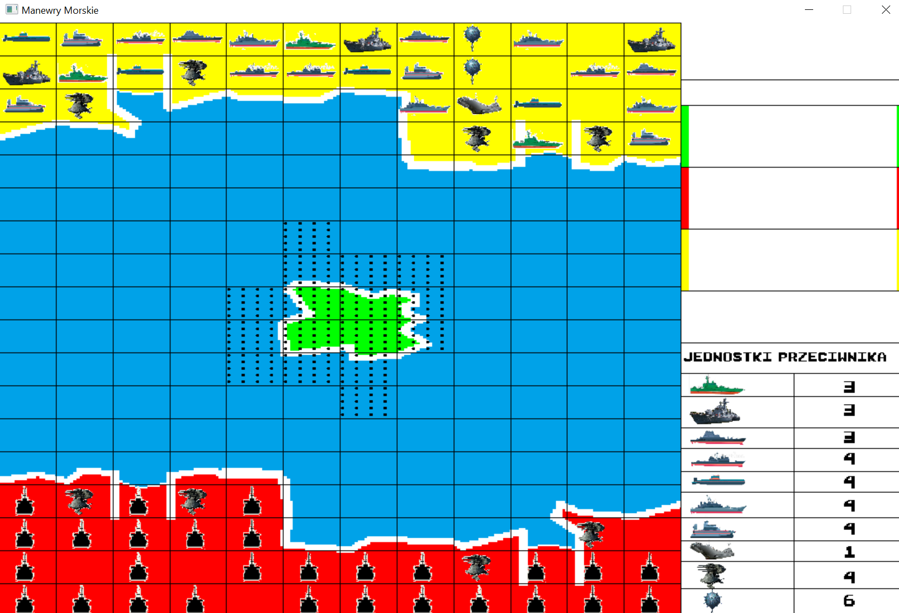
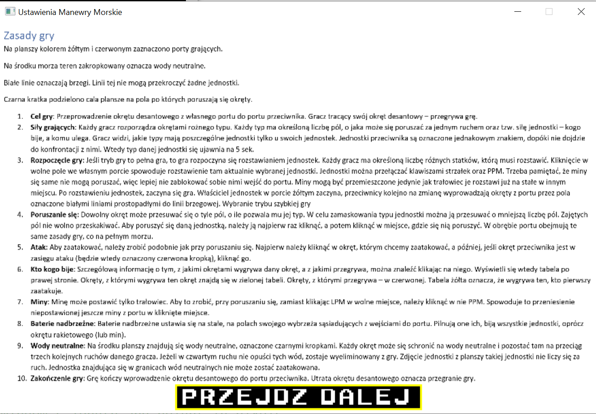

## General
I created this game in C++ using SDL graphic library. The idea of this game was modeled on the board game.
I created it to play with oponnent via LAN network

## First screen

## Game screen

## How to move

## Rules (in polish)

